# Quarto Simulator and AI Agents

My Computer Science BSc Honours research project involved creating a Quarto game simulator that was capable of completely and accurately simulating the game's progress, then creating an artificial intelligence agent using a genetic algorithm and comparing this with an agent implemented using a conventional Minimax algorithm.

There are currently two implementations of the simulator in this repo:
- [quarto_py](quarto_py) - original Python implementation used for research experiments. Also has a basic, configurable GUI to play the game. Run the [gui.py](gui.py) file - need to set the player 1 as Human Agent at the moment.
- [quarto_rust](quarto_rust) - newer, faster Rust implementation of the simulator and all agents. No GUI at the moment.

## What is Quarto?
Quarto is a two-player strategy board game that involves placing pieces on a 4x4 grid. Each of the sixteen pieces have four binary attributes - colour (light/dark), shape (round/square), height (tall/short), and presence of hole (hollow/solid). The objective of the game is to place a piece that forms a line of four pieces with at least one common attribute. What makes Quarto interesting is that your opponent selects the piece you will place during your turn and vice versa. 

Here is a useful link explaining the rules of the game: https://www.ultraboardgames.com/quarto/game-rules.php

## QUARTO SIMULATOR GUIDE
---

#### Bit representation (from left to right)
| N^th^ Bit |   0   |   1   |
|-----------|-------|-------|
| 1 | dark | light |
| 2 | round | square |
| 3 | short | tall |
| 4 | hollow | solid |

#### Piece Representation
| VALUE | BINARY | IMAGE             |       | VALUE | BINARY | IMAGE              | 
|:-----:|:------:|:-----------------:|-------|:-----:|:------:|:------------------:|
| 0     | 0000   | 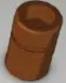 |       | 8     | 1000   | 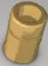  |
| 1     | 0001   |  |       | 9     | 1001   |   |
| 2     | 0010   |  |       | 10    | 1010   | 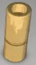 |
| 3     | 0011   | 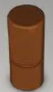 |       | 11    | 1011   | 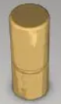 |
| 4     | 0100   | 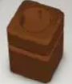 |       | 12    | 1100   | 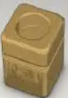 |
| 5     | 0101   | 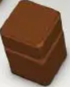 |       | 13    | 1101   | 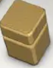 |
| 6     | 0110   | 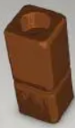 |       | 14    | 1110   |  |
| 7     | 0111   | 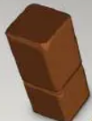 |       | 15    | 1111   |  |
